### 🚀 IT Undergraduate | Full-Stack Developer | AI Enthusiast

---

## 🎓 About Me

I'm a dedicated IT undergraduate from the **Institute of Technology, University of Moratuwa (ITUM)**, passionate about building scalable, cloud-native systems and AI-driven solutions. I love turning ideas into intelligent, production-ready applications.

- 🔭 Currently working on **ClaimSense** - An AI-powered Insurance Triage SaaS
- 🌱 Learning about **Agentic AI Systems** and **MLOps**
- 📸 Freelance photographer and videographer (3-year diploma from NPAS)
- 💡 Interested in cloud-based development, workflow automation, and intelligent systems

---

## 🛠️ Tech Stack

### Languages

### Frameworks & Libraries

### Databases & Tools

### DevOps & Cloud

### AI/ML

---

## 🚀 Featured Projects

### 🔷 [FlexiTask - Job Posting Board](https://flexi-task-zeta.vercel.app) 
Modern full-stack job posting platform with SEO optimization and admin management.

**Tech Stack:** Next.js 16, TypeScript, Supabase (PostgreSQL), Prisma, NextAuth.js, Tailwind CSS, Cloudinary

**What I've Done So Far:**
- 📊 Built complete database with 8+ models (jobs, categories, locations, users)
- 🏗️ Created hierarchical job categorization system
- 🌍 Implemented Country-City location management
- 🔐 Set up NextAuth.js authentication (credentials + OAuth)
- 📸 Integrated Cloudinary for image uploads
- 🔍 Added advanced filtering (job type, location, experience)
- 📈 Built job view tracking and analytics
- 🔒 Implemented security (XSS protection, input validation)
- 🎯 Created admin dashboard with role-based access
- 📝 Comprehensive documentation for deployment

---

### 🔷 [FlexiTask Automations](https://github.com/DevindaJ517/FlexiTask-Automations) *(Telegrame Live-Ongoing)*
Automation workflows and tooling for FlexiTask platform optimization.

**Tech Stack:** Python Fast Api, GitHub Actions, Automation Scripts

**What I've Done So Far:**
- 🏗️ Designed automation architecture
- ⚙️ Set up CI/CD with GitHub Actions
- ✅ Created data validation scripts
- 🔄 Built database sync tools
- ⏰ Implemented scheduled maintenance tasks

---

### 🔷 [ClaimSense - AI-Powered Insurance Triage SaaS](https://github.com/SasinduV0/Claim-Sense) *(Ongoing)*
Cloud-native SaaS platform automating insurance claim triage with intelligent fraud detection.

**Tech Stack:** Python, FastAPI, Custom ML Models, NLP, Google Cloud Platform

**Key Features:**
- Custom machine learning models for fraud detection
- NLP pipelines for smart claim routing
- Real-time claim analysis and categorization
- Deployed on GCP for enterprise-grade scalability

---

### 🔷 [Cleverly - Review-Based Social Media](https://github.com/thimiratk/Cleverly---Final-Project.git)
A microservices-based social media platform focused on reviews and community engagement.

**Tech Stack:** Node.js, Express.js, MongoDB, Redis, Docker, NX Monorepo, Prisma

**Key Features:**
- Microservices architecture for scalability
- Redis caching layer for optimized performance
- Dockerized containerization
- CI/CD pipeline with GitHub Actions

---

## 📊 GitHub Stats

  

> 

---

## 🎯 Career Interests

- ☁️ Cloud-based application development
- 🤖 Agentic AI systems & applied machine learning
- 🔧 Scalable full-stack and AI-powered product development
- 🚀 MLOps & DevOps automation (CI/CD, model deployment, monitoring)
- 🔄 Intelligent workflow orchestration & cloud-native automation

---

## 📫 Let's Connect!

I'm always open to collaborating on interesting projects or discussing technology!

- 📧 Email: [hirandevinda8@gmail.com](mailto:hirandevinda8@gmail.com)
- 💼 LinkedIn: [Hiran Devinda](https://linkedin.com/in/hiran-devinda-656966263/)
- 🐙 GitHub: [@DevindaJ517](https://github.com/DevindaJ517)
- 📍 Location: Agalawatta, Sri Lanka

---

  
### 💡 "Turning ideas into intelligent, scalable solutions"

